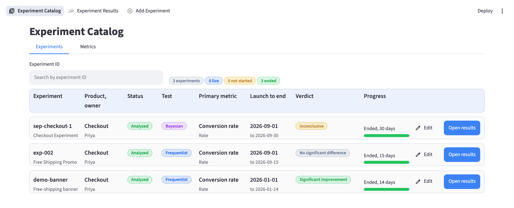
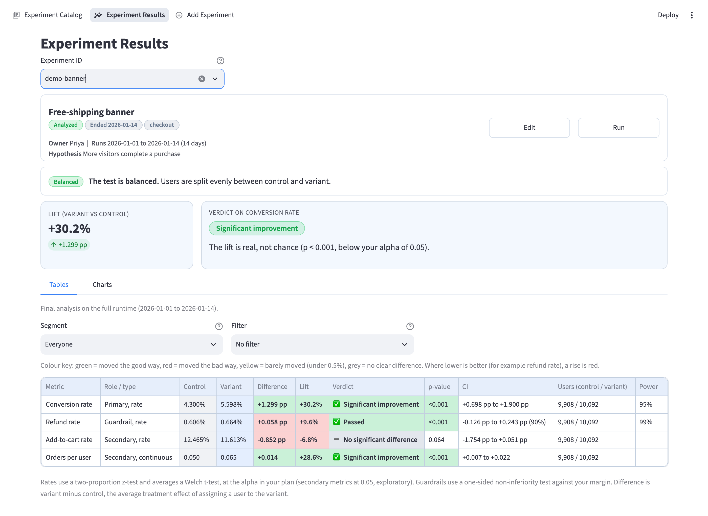
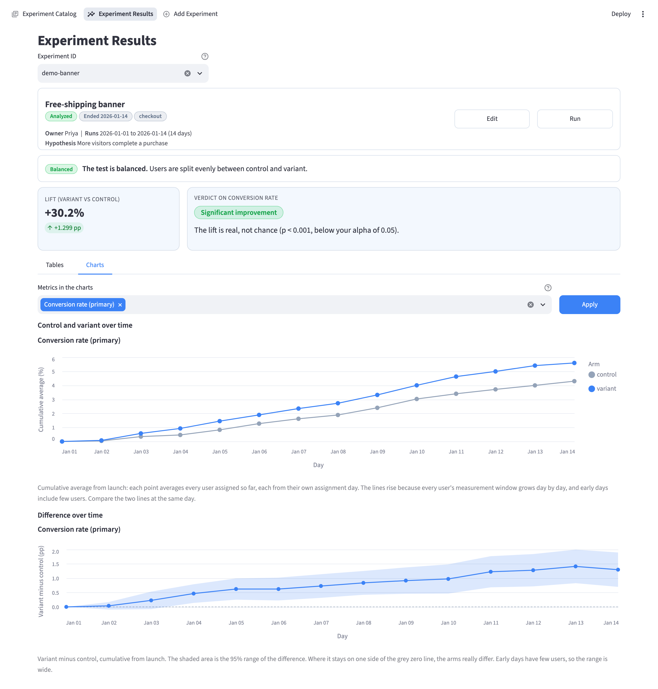
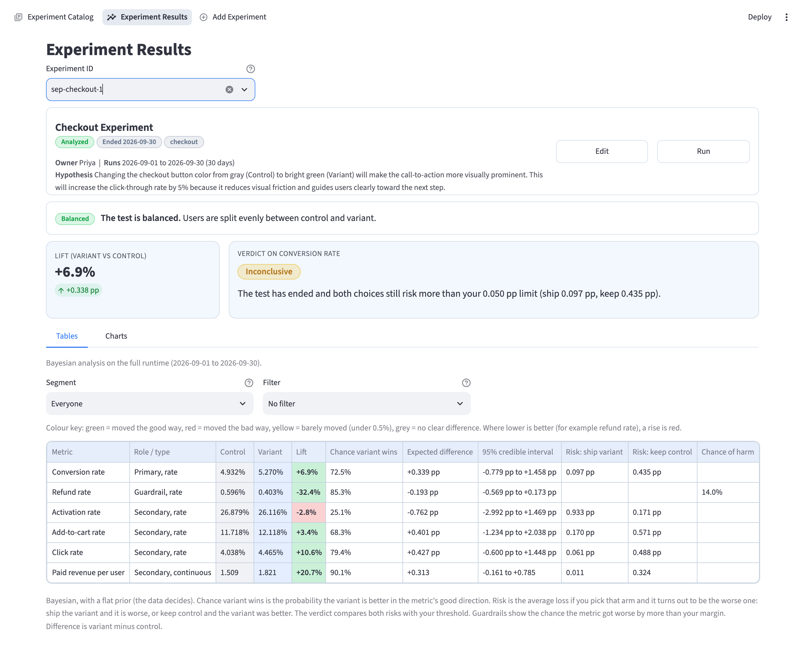
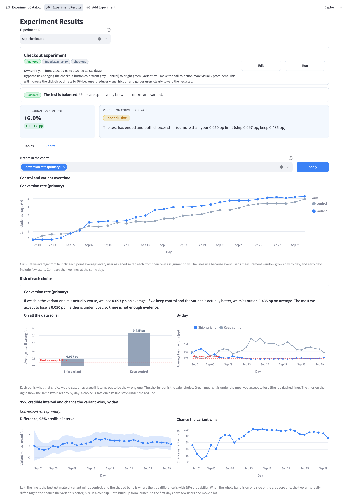
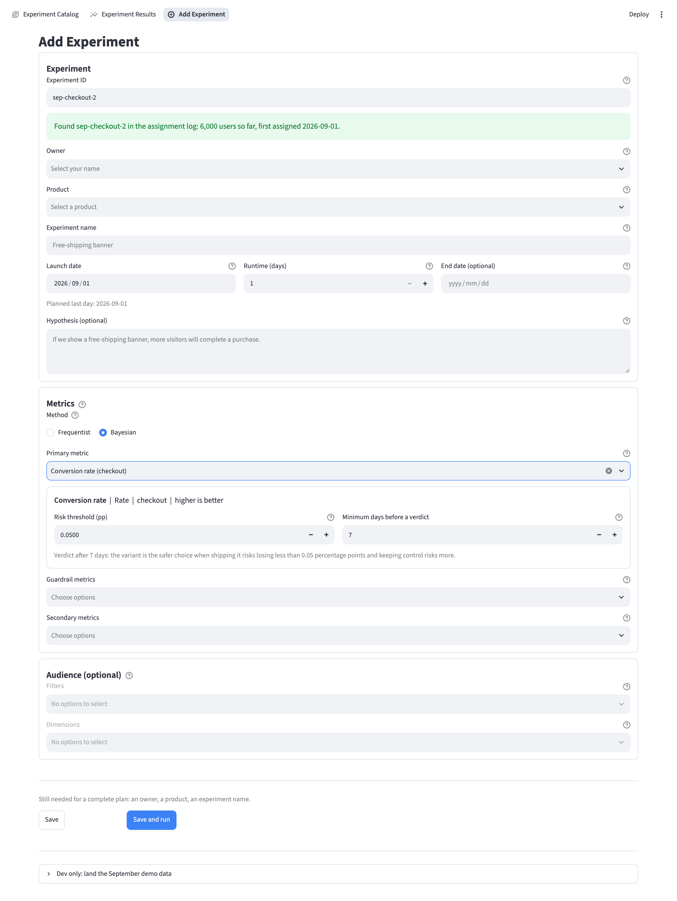

# P2: Experiment Platform (demo)

A small internal tool where data scientists add A/B experiments and product managers follow the results. It is a learning and demo project built on synthetic data. It runs on Streamlit with BigQuery as the only store.

## Screenshots

Synthetic data only. Experiment Catalog (the default page): every experiment with its test type (Bayesian or Frequentist), status, verdict and progress.



Experiment Results, frequentist: the balance card on top, the lift and the verdict with a one-line reason, and a table per metric.



The same page, Charts tab: control and variant over time, and the difference with its 95% confidence band.



Experiment Results, Bayesian: the verdict says why in one line, and the table adds the chance the variant wins, the 95% credible interval and the risk of each choice.



The same page, Charts tab: control and variant over time, the risk of each choice (on all the data and by day, against the most you accept to lose), and the 95% credible interval and chance the variant wins by day.



Add Experiment: type an ID that exists in the assignment log, pick the method, and only that method's inputs show (here Bayesian).



## What it does

- **Experiment Catalog** (default page): every experiment with its test type, status, verdict and progress, plus a Metrics tab. Edit an experiment in place.
- **Experiment Results**: pick an experiment from the dropdown (type to filter the ones already in the app). A card at the top says whether the test is balanced (sample ratio check), then the lift and the verdict with a one-line reason, tables (by segment and filter) and charts over time. Frequentist: live numbers while running, full tests and a verdict only after the last day. Bayesian: chance the variant wins, risk of each choice and a verdict that can be read live after a minimum number of days. The Charts tab changes only when you press Apply.
- **Add Experiment**: the data scientist picks the method (Frequentist or Bayesian) and enters the plan for it. Frequentist asks for their own statistics numbers (the tool does not do power calculations); Bayesian asks for a risk threshold and a minimum number of days, with defaults. The ID must already exist in the experiment tool's assignment log.
- **Runs** go to a background queue (4 at a time, one per experiment) so pages stay fast.

## How it works

- Source tables (raw) are cleaned by generated staging views, then a per-experiment table is built from small metric, segment and filter queries. See [DATA_SOURCES.md](DATA_SOURCES.md).
- Statistics: two-sample tests, confidence intervals and a sample ratio check (`src/p2/stats/tests.py`, `srm.py`), and a Bayesian method (`src/p2/stats/bayes.py`: Beta-Binomial for rates, Normal posterior for averages, flat prior, computed from the saved counts, means and variances when the page opens, so no extra BigQuery scan).
- The app keeps state in memory and writes to BigQuery in the background. See [SCALABILITY.md](SCALABILITY.md).
- Full design: [TECH_SPEC.md](TECH_SPEC.md). Roadmap and checklist: [PLAN.md](PLAN.md). Why things were decided: [P2_Decisions_Log.md](P2_Decisions_Log.md). Table dictionary: [SCHEMA.md](SCHEMA.md).

## Run it

You need Python 3.12 or newer and Google Cloud credentials with BigQuery access (`gcloud auth application-default login`). The project id is set in `src/p2/warehouse/bq.py` (`DEFAULT_PROJECT`); change it to your own.

```bash
python -m venv .venv && source .venv/bin/activate
pip install -r requirements.txt && pip install -e .
python -m p2.simulator            # creates the datasets and lands the synthetic users (once)
streamlit run app/streamlit_app.py
```

- On the Add Experiment page, open "Dev only: land the September demo data". It lands 6 demo experiments (`sep-checkout-1`, `sep-email-2` and so on) with users assigned on every day of 1 to 30 Sep 2026, so any launch and end date inside September works. It takes a few minutes.
- Settings (environment variables): `P2_ENV` (dataset set, default `dev`), `P2_STORE` (`bigquery` or `memory`), `P2_DEV_TOOLS=0` (hide the dev button), `P2_REFRESH_SECONDS`, `P2_FLUSH_SECONDS`, `P2_MAX_RUNS`.

## Tests

```bash
pytest -m "not bq"    # offline, 458 tests, about 30 seconds
pytest -m bq          # against BigQuery in throwaway datasets, very slow
```

## Not in scope (demo)

Sign-in and permissions (everyone acts as one identity), deployment, cost guards, CUPED, ratio metrics and multiple-comparison correction. For Bayesian: only the flat prior (no informative prior, ROPE band or partial pooling) and no heavy-tail model for revenue. The app is not deployed on purpose: it has no sign-in, and every Run scans BigQuery on the owner's account.

## What I would do for production

- **Sign-in:** put the app behind the company's Google sign-in and map the signed-in person to the Owner field and to edit rights.
- **Hosting:** a container (Docker) on Cloud Run, one server, dev tools off (`P2_DEV_TOOLS=0`), a long request timeout.
- **Daily refresh:** a scheduled job (Cloud Scheduler) that refreshes monitoring for every live experiment each morning, with a notification when a Run fails or the split looks wrong.
- **Cost guards:** a dry-run size check and a cap on bytes per Run, a BigQuery daily quota, and pruning of old Run history.
- **Safety nets:** an edit-conflict warning when two people change the same experiment, and CI that runs the BigQuery tests.
- **Why not built:** the demo uses one fixed synthetic month and a few experiments, so none of this changes what the project shows. The design notes are in [SCALABILITY.md](SCALABILITY.md) and [PLAN.md](PLAN.md).
